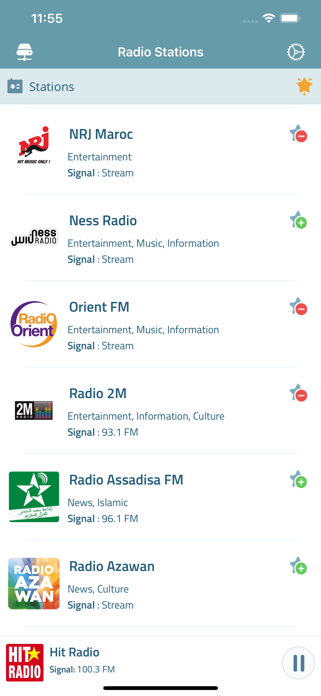
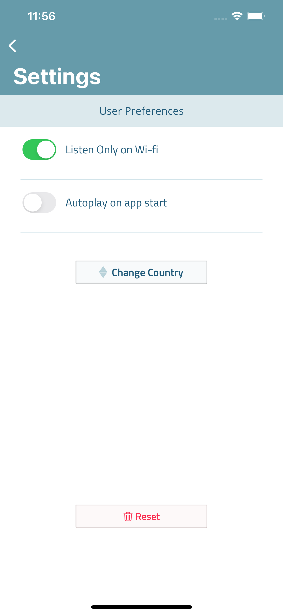

# ArabRadio
 

 
 

 On Radio Arab you can listen to your favorite stations via WebRadio, more than 150 Stations are available as we start this app. 

## Features
- Listen To FM Stations via WebRadio
- Play Radio on Background
- Change Stations from **Lock Screen**
- Add stations to Favorite
- Easy Stations list update only by Pulling-Down the screen
- Quick Search Access
- Delete stations from the list
- Enable/Disable Radio access on Wifi Or Cellular
- Auto-Play on App start
- Multiple Countries & Stations Access
- Reset App (Easy)
- Record & Share Audio files easy

## TestFlight Link

## Screenshots

 
 
 
 
 
 
 

